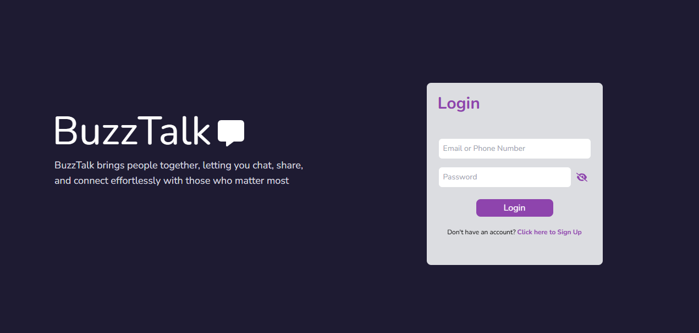
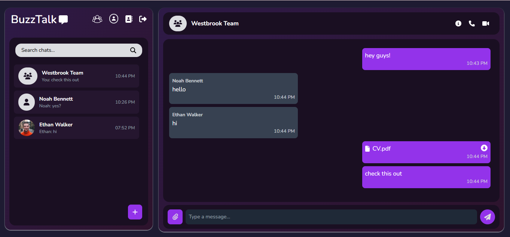
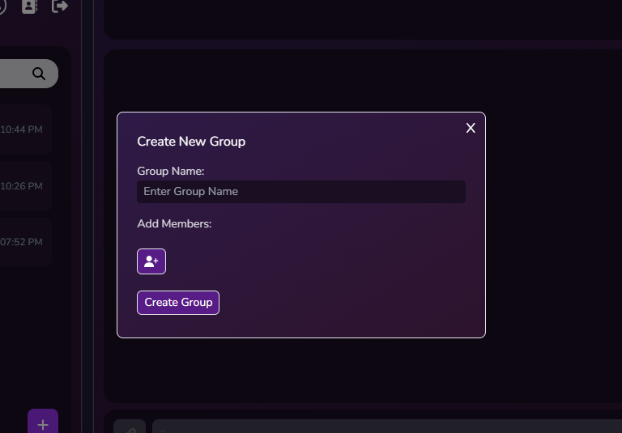
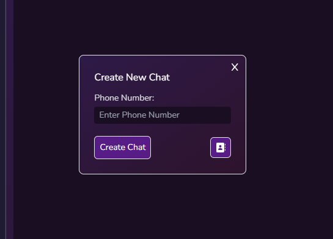
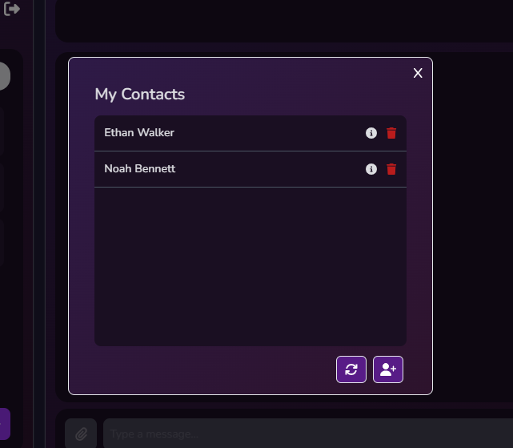
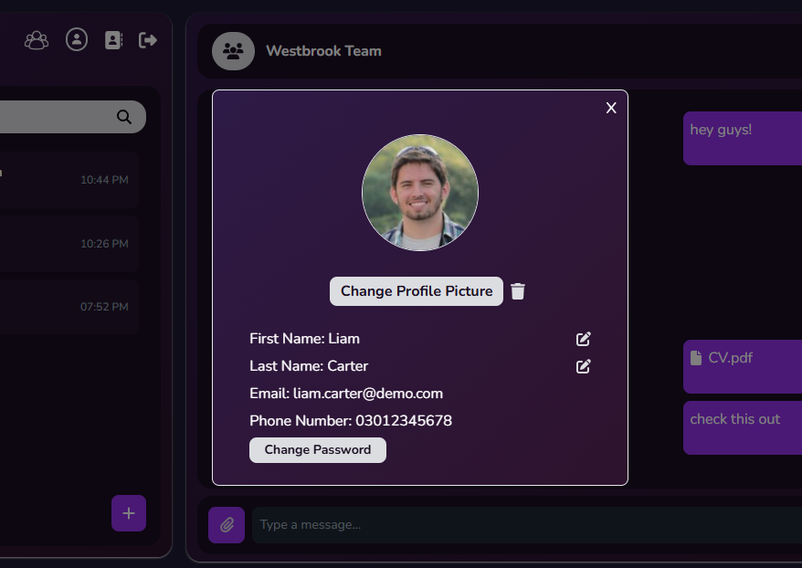

# 💬 BuzzTalk

BuzzTalk is a real-time chat application built with the MERN stack (MongoDB, Express.js, React.js, Node.js). It offers seamless one-on-one and group messaging functionality with a modern, responsive user interface. The app uses Socket.IO for real-time communication, JWT for secure authentication, and integrates Cloudinary for efficient profile image management.

## 🚀 Features

- **Real-time Messaging**: Instant one-on-one and group chats using Socket.IO.
- **Group Chats**: Create and manage group conversations.
- **User Authentication**: Secure registration and login with JWT.
- **User Profiles**: Customizable profiles with avatar uploads via Cloudinary.
- **Responsive UI**: Built with Tailwind CSS and enhanced with Framer Motion for smooth animations.

## 🛠️ Tech Stack

### Frontend

- **React.js**: Component-based UI library.
- **Tailwind CSS**: Utility-first CSS framework for responsive design.
- **Framer Motion**: Animation library for React to enhance user interactions.
- **Axios**: Promise-based HTTP client for API calls.
- **React Router**: Declarative routing for React applications.

### Backend

- **Node.js**: JavaScript runtime environment.
- **Express.js**: Web framework for building APIs.
- **MongoDB**: NoSQL database for storing user and chat data.
- **Mongoose**: ODM for MongoDB, providing a schema-based solution.
- **Socket.IO**: Enables real-time, bi-directional communication.
- **JWT (JSON Web Tokens)**: Secure authentication mechanism.
- **Cloudinary**: Cloud-based image and video management.

## User Interface Overview

Here’s a visual overview of the key sections of the app:

### **1. Home / Login / Signup Page**  
Users can register a new account or log in to their existing account to start chatting.  

  

### **2. Main Chat Page**  
The main hub for chatting with your contacts and groups.  

  

### **3. Add Group Chat Popup**  
Create a new group chat to stay connected with multiple people.  

  

### **4. Add New Chat Popup**  
Start a conversation with a new contact quickly.  

  

### **5. My Contacts Popup**  
Manage your contact list and add new friends.  

  

### **6. Profile Information Popup**  
View and edit your profile information.  

  


## Demo Accounts

To test the app without needing to create your own account, you can use the following demo accounts:

1. **Account 1:**
   - **Email:** liam.carter@demo.com
   - **Password:** password12345

2. **Account 2:**
   - **Email:** ethan.walker@demo.com
   - **Password:** password12345

3. **Account 3:**
   - **Email:** noah.bennett@demo.com
   - **Password:** password12345

Feel free to log in with any of these accounts to explore the features of the app!

## 📦 Installation

To run this project locally, follow these steps:

### Prerequisites

- Node.js and npm installed
- MongoDB instance (local or cloud-based)
- Cloudinary account for image uploads

### Clone the Repository

```bash
git clone https://github.com/ZaidRehmannn/BuzzTalk.git
cd BuzzTalk
```

---

### 🔧 Backend Setup

1. **Navigate to the backend directory**:

   ```bash
   cd backend
   ```

2. **Install dependencies**:

   ```bash
   npm install
   ```

3. **Configure environment variables**:

   Create a `.env` file in the `backend` directory and add the following:

   ```env
   MONGO_URI=your_mongodb_connection_string
   JWT_SECRET=your_jwt_secret
   CLOUDINARY_CLOUD_NAME=your_cloudinary_cloud_name
   CLOUDINARY_API_KEY=your_cloudinary_api_key
   CLOUDINARY_API_SECRET=your_cloudinary_api_secret
   ```

4. **Start the backend server**:

   ```bash
   npm run server
   ```

   The backend server will start on `http://localhost:4000`.

---

### 🌐 Frontend Setup

1. **Navigate to the frontend directory**:

   ```bash
   cd ../frontend
   ```

2. **Install dependencies**:

   ```bash
   npm install
   ```

3. **Configure environment variables**:

   Create a `.env` file in the `frontend` directory and add the following:

   ```env
   VITE_API_URL=http://localhost:4000/api
   ```

4. **Start the frontend development server**:

   ```bash
   npm run dev
   ```

   The frontend will be accessible at `http://localhost:5173`.

---

Now, you can use BuzzTalk locally with full functionality, including real-time messaging and animated UI interactions.
